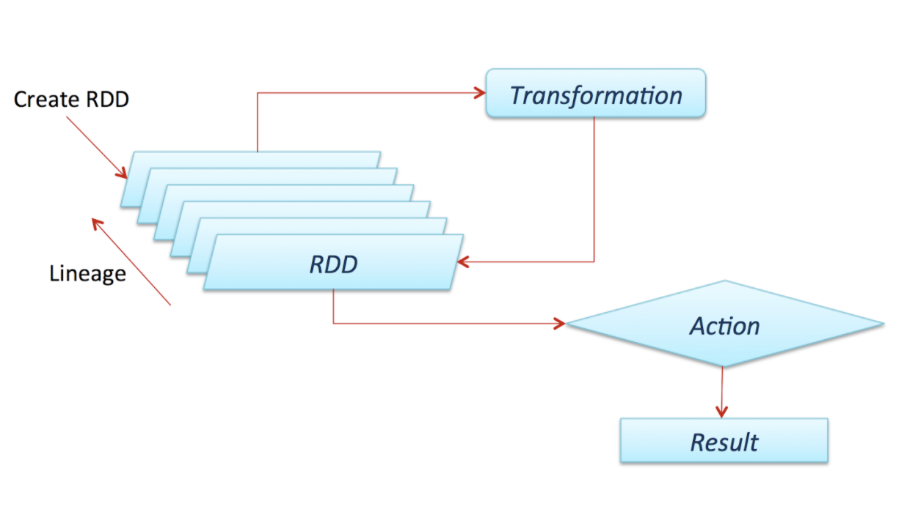

# Big Data Workshop

Workshop For VandyHacks 7

## Apache Spark Topics: 

### RDD - Resilient Distributed Dataset

- The primary data structure in Spark
- Can be operated on in parallel

	

### Laziness

- All transformations are lazy, meaning that an assignment to a collection created by a transformation is not actually computed until an action requires it. 

### Reduce

> “Aggregate the elements of the dataset using a function func (which takes two arguments and returns one). The function should be commutative and associative so that it can be computed correctly in parallel.”

### Map

- Transforms some set of data into another set of data using a function that operates on each individual data point.

### FlatMap

- Map, followed by a flatten (removes one level of “array-ness”). 
